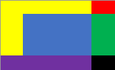

# Contando instruções
Tendo como base as instruções disponibilizadas no moodle, e as regras:

>1. Preenche a matriz N x N com números inteiros aleatórios de 0 a 99;
>
>2. Considere a posição Linha 0 e Coluna 0 (0,0) como início;
>
>3. Considere a posição (N, N) como posição final;
>
>4. Percorra a matriz a partir do início, somando a cada passo, o próximo maior valor encontrado;
>
>5. O próximo valor pode ser o que está na mesma linha e imediatamente à direita, imediatamente à esquerda, bem como, o que está na coluna abaixo do numero corrente;
>
>    1. Há apenas uma exceção de percurso. Ao chegar na última linha deve-se percorre-la até o fim sem realizar mais migrações para colunas acima. 
>
>6. Andando na matriz conforme as regras acima, qual o maior caminho do início até o final, sabendo-se que a soma das posições representa o tamanho do caminho.

# Logica
Foi-se feito um programa com a seguinte lógica:    
Existe um objeto **Matrix** que possui uma matriz do objeto **Item**, e dois integer que ditam a posição que está se verificando no ciclo atual.     
O objeto **Item** possui um integer que dita o valor daquele **Item**, e um booleano que é utilizado para checar se este **Item** já foi verificado.    

1) Ao entrar no programa a primeira função encontrada é *preencherMatriz(&m)*, que preenche uma **Matrix** m de tamanho MATTAM x MATTAM (Definido em matrix.h) com números aleatórios de 0 a 99, além de tornar os valores dos integers de posição e passagem para 0/false;    

2) A segunda função *printaMatrix(&m)* tem o objetivo de mostrar a **Matrix** m após seu preenchimento;     

3) A terceira função *andarMatriz(&m)* possui a seguinte lógica:    
         &nbsp;&nbsp;&nbsp;&nbsp;&nbsp;&nbsp;&nbsp;Enquanto a posição atual não for igual a ultima:     
         &nbsp;&nbsp;&nbsp;&nbsp;&nbsp;&nbsp;&nbsp;Checa para saber em qual dos quadrantes abaixo a posição atual está     

 

&nbsp;&nbsp;&nbsp;&nbsp;&nbsp;&nbsp;&nbsp;Lógica para cada quadrante:

- Amarelo: 
    1. Checa se o de baixo>=direita, se sim:
        - Caminha para baixo;
    2. Caso contrário:
        1. Checa se o da direita já foi passado, se não:
            - Caminha para direita;
        2. Caso contrário 
            - Caminha para baixo;

- Vermelho: 
    - Caminha para baixo;

- Verde: 
    1. Checa se o de baixo>=esquerda, se sim:
        - Caminha pra baixo;
    2. Caso contrário:
        1. Checa se o da esquerda já foi passado, se não:
            - Caminha para esquerda
        2. Caso contrário:
            - Caminha para baixo;

- Roxo: 
    - Caminha para direita;

- Azul:
    1. Checa se o de baixo>=direita e baixo>=esquerda, se sim:
        - Caminha para baixo;
    2. Caso contrário, checa se o da direita>=baixo e direita>=esquerda:
        1. Checa se o da direita já foi passado, se não:
            - Caminha para direita;
        2. Se sim:
            1. Checa se o de baixo>=esquerda, se sim:
                - Caminha para baixo;
            2. Se não:
                - Caminha para esquerda;
    3. Caso contrário:
        1. Checa se o da esquerda já foi passado, se não:
            - Caminha para esquerda;
        2. Se sim:
            1. Checa se o de baixo>=direita, se sim:
                - Caminha para baixo;
            2. Se não:
                - Caminha para direita;     
Obs.:    
- Caminhar quer dizer somar 1 à linha ou coluna atual, e tornar a verificação de passagem dessa posição como true;
- A cada ciclo é somado 1 em um contador de passos;
- A cada ciclo é somado o valor do item a um somatório do caminho;

Ao final do ciclo é impressa a soma dos passos e o somatório do caminho;

4) A quarta função *printCaminho(&m)* mostra a relação de 1 e 0 para cada posição do caminho percorrido, sendo 1=passou e 0=não passou;

# Compilação e Execução

O programa possui um arquivo Makefile que realiza todo o procedimento de compilação e execução. Para tanto, temos as seguintes diretrizes de execução:

| Comando                |  Função                                                                                           |                     
| -----------------------| ------------------------------------------------------------------------------------------------- |
|  `make clean`          | Apaga a última compilação realizada contida na pasta build                                        |
|  `make`                | Executa a compilação do programa utilizando o gcc, e o resultado vai para a pasta build           |
|  `make run`            | Executa o programa da pasta build após a realização da compilação                                 |
